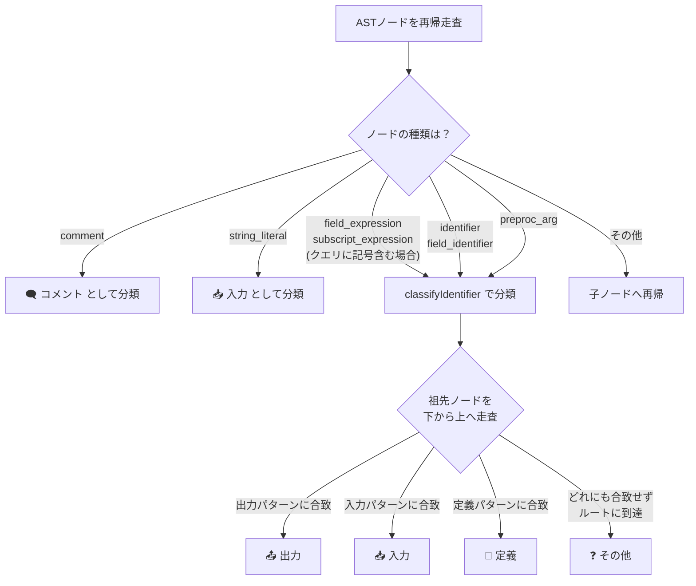

# C-Grep Classifier データフロー分類 技術仕様書

本ドキュメントは、C-Grep Classifier 拡張機能が検索キーワードの出現箇所をどのようにデータフロー分類しているかを詳細に説明します。

---

## 概要

本拡張機能は、C言語ソースファイル（`.c`, `.h`）に対して [tree-sitter](https://tree-sitter.github.io/tree-sitter/) による構文解析（AST: 抽象構文木）を実行し、検索キーワードが出現する各箇所を以下の **5つのカテゴリ** に分類します。

| カテゴリ | 意味 | 色 |
|---|---|---|
| **入力** | 値が読み取られている箇所（参照） | 🔵 青 |
| **出力** | 値が書き込まれている箇所（代入） | 🔴 赤 |
| **定義** | 変数・関数・型などが宣言・定義されている箇所 | 🟢 緑 |
| **コメント** | コメント内に出現している箇所 | ⚪ 灰 |
| **その他** | 上記のいずれにも該当しない箇所 | 🟠 橙 |

---

## 分類の全体フロー



> [!IMPORTANT]
> 分類の優先順位は **出力 → 入力 → 定義 → その他** の順です。祖先ノードを下から上へ辿り、最初に合致したパターンで分類が確定します。

---

## フェーズ1: 検索対象ノードの特定

ASTの全ノードを再帰的に走査し、以下の種類のノードが検索キーワードに一致した場合に検索結果として抽出します。

### 1.1 コメントノード (`comment`)

```c
// hogeの説明          ← 行コメント
/* hogeを使う処理 */   ← ブロックコメント
```

- ASTの `comment` ノード内に検索キーワードが含まれている場合、**無条件に「コメント」カテゴリ**に分類されます。
- `classifyIdentifier` 関数は呼ばれません。
- 複数行コメントの場合、行単位で分割してキーワードが含まれる行のみを個別の検索結果として登録します。
- 同一行内に複数回出現する場合、それぞれの出現位置を個別に検出します。

### 1.2 文字列リテラル (`string_literal`)

```c
printf("hogeの値は%d", hoge);
//      ^^^^
//      この部分が string_literal として検出される
```

- 文字列リテラル内に検索キーワードが含まれている場合、**無条件に「入力」カテゴリ**に分類されます。
- `classifyIdentifier` 関数は呼ばれません。

### 1.3 識別子 (`identifier`, `field_identifier`)

```c
int hoge = 10;     // identifier: "hoge"
s.member = 5;      // field_identifier: "member"
```

- 変数名、関数名、型名など、コード中に出現するすべての識別子が対象です。
- `field_identifier` は構造体メンバー名（ドットやアロー演算子の右側）です。
- 一致した場合、`classifyIdentifier` 関数で祖先ノードを辿って分類されます。

### 1.4 構造体/配列アクセス式 (`field_expression`, `subscript_expression`)

```c
s.member = 10;     // field_expression: "s.member"
arr[0] = 5;        // subscript_expression: "arr[0]"
```

- **検索キーワードに `.`, `->`, `[` のいずれかが含まれる場合のみ**評価されます。
- 式全体のテキストとキーワードを比較し、一致した場合は `classifyIdentifier` で分類します。
- 一致した場合、子ノード（個別の識別子）の走査はスキップし、重複検出を防ぎます。

### 1.5 マクロ定義の右辺値 (`preproc_arg`)

```c
#define MAX_SIZE (hoge + 1)
//               ^^^^^^^^^^
//               preproc_arg ノード
```

- `#define` の置き換え値部分（右辺）に検索キーワードが含まれている場合に検出されます。
- `classifyIdentifier` 関数で分類されます。
- 同一行内に複数回出現する場合、それぞれの出現位置を個別に検出します。

---

## フェーズ2: データフロー分類の詳細 (`classifyIdentifier`)

フェーズ1で抽出されたノード（`comment` と `string_literal` を除く）は、`classifyIdentifier` 関数によって **祖先ノードを下から上へ辿る** ことでカテゴリが決定されます。

### 2.1 出力（📤 書き込み）

出力として分類される条件は以下の3パターンです。**最も優先度が高い**判定です。

---

#### パターン1: 代入式の左辺 (`assignment_expression` の `left`)

```c
hoge = 10;           // hoge → 出力
hoge += value;       // hoge → 出力（複合代入も含む）
s.member = 5;        // s.member → 出力
```

検索キーワードが代入演算子（`=`, `+=`, `-=`, `*=`, `/=`, `%=`, `<<=`, `>>=`, `&=`, `|=`, `^=`）の **左辺** に位置している場合。

---

#### パターン2: インクリメント/デクリメント (`update_expression`)

```c
hoge++;              // hoge → 出力
--hoge;              // hoge → 出力
```

`++` または `--` 演算子の対象となっている場合。前置・後置の両方が該当します。

---

#### パターン3: アドレス取得演算子 (`pointer_expression` で `&`)

```c
scanf("%d", &hoge);  // hoge → 出力
func(&hoge);         // hoge → 出力
```

`&` 演算子でアドレスが取得されている場合。関数にポインタとして渡される場面で、変数の値が書き換えられる可能性があるため「出力」として扱います。

> [!NOTE]
> ポインタのデリファレンス（`*ptr`）はこのパターンには該当しません。`*` 演算子の場合は出力とは判定されず、後続の入力や定義の判定に進みます。

---

### 2.2 入力（📥 読み取り・参照）

出力パターンに合致しなかった場合、入力として分類される条件が評価されます。

---

#### パターン1: 代入式の右辺 (`assignment_expression` の `right`)

```c
result = hoge;       // hoge → 入力
result = hoge + 1;   // hoge → 入力
```

代入演算子の **右辺** に位置している場合。値が読み取られていることを意味します。

---

#### パターン2: 初期化式の値部分 (`init_declarator` の `value`)

```c
int result = hoge;   // hoge → 入力
int arr[] = {hoge};  // hoge → 入力
```

変数宣言時の初期化値として参照されている場合。

---

#### パターン3: 条件式内 (`if`, `while`, `for` の `condition`)

```c
if (hoge > 0) { }       // hoge → 入力
while (hoge != 0) { }   // hoge → 入力
for (i = 0; i < hoge; i++) { }  // hoge → 入力
```

制御構文の条件部分で値が評価（読み取り）されている場合。

---

#### パターン4: 関数引数 (`argument_list`)

```c
printf("%d", hoge);  // hoge → 入力
func(hoge, 10);      // hoge → 入力
```

関数呼び出しの引数として渡されている場合。

> [!NOTE]
> `&hoge` のようにアドレスが渡されている場合は、先に出力パターン3（アドレス取得）で捕捉されるため、ここには到達しません。

---

#### パターン5: 二項演算式 (`binary_expression`)

```c
int x = a + hoge;    // hoge → 入力
if (a == hoge) { }   // hoge → 入力（条件式内の判定より先にヒットすることもある）
```

加減乗除や比較演算の一部として値が参照されている場合。

---

#### パターン6: return文 (`return_statement`)

```c
return hoge;         // hoge → 入力
return hoge + 1;     // hoge → 入力
```

`return` で値が返される際に参照されている場合。

---

#### パターン7: switch/case文 (`switch_statement`, `case_statement`)

```c
switch (hoge) { }    // hoge → 入力
case hoge: break;    // hoge → 入力
```

`switch` の評価対象や `case` のラベル値として参照されている場合。

---

### 2.3 定義（📝 宣言・定義）

出力にも入力にも合致しなかった場合、定義として分類される条件が評価されます。

---

#### パターン1: typedef の宣言子 (`type_definition` の `declarator`)

```c
typedef int hoge;            // hoge → 定義
typedef struct { } hoge_t;   // hoge_t → 定義
```

`typedef` で新しい型名が定義されている場合。

---

#### パターン2: enum定数メンバー (`enumerator`)

```c
enum Color { RED, GREEN, BLUE };
//           ^^^  ^^^^^  ^^^^  すべて → 定義
```

`enum` の各定数名として定義されている場合。

---

#### パターン3: マクロ引数 (`preproc_params`)

```c
#define FUNC(hoge, arg2) ((hoge) + (arg2))
//           ^^^^  ^^^^  マクロ引数 → 定義
```

関数マクロのパラメータとして定義されている場合。

---

#### パターン4: 変数宣言 (`declaration`, `parameter_declaration`)

```c
int hoge;                    // hoge → 定義
int hoge = 10;               // hoge → 定義（※初期化値の中のhogeは入力）
void func(int hoge) { }     // hoge → 定義（関数引数）
extern int hoge;             // hoge → 定義
static int hoge;             // hoge → 定義
```

変数やパラメータが宣言されている場合。ただし、型名部分（`int`, `char` など）に検索キーワードが含まれる場合は除外されます。

> [!IMPORTANT]
> `int hoge = hoge_init;` のような初期化付き宣言では、左辺の `hoge` は「定義」、右辺の `hoge_init` は「入力」として、それぞれ正しく分離されます。

---

#### パターン5: 初期化宣言子の宣言部分 (`init_declarator` の `declarator`)

```c
int hoge = 10;               // hoge → 定義（declarator部分）
```

`int hoge = 10;` において、`hoge` は `init_declarator` の `declarator` フィールドに位置するため「定義」と判定されます（`10` 側は `value` フィールドのため入力パターン2で先に捕捉されます）。

---

#### パターン6: 構文エラー内の宣言救済 (`ERROR` ノード配下の `declaration`)

```c
GLOBAL SBYTE hoge;           // hoge → 定義（パーサーがGLOBALを認識できずERRORになる場合）
```

前置マクロなどにより tree-sitter がパース失敗（`ERROR` ノード生成）した場合でも、その親が `declaration` であれば「定義」として救済します。

---

#### パターン7: 関数定義の宣言子 (`function_definition` の `declarator`)

```c
void hoge(int a) { }        // hoge → 定義
int main(void) { }          // main → 定義
```

関数が定義されている場合。関数名部分が「定義」として分類されます。

---

#### パターン8: マクロ定義名 (`preproc_def`, `preproc_function_def` の `name`)

```c
#define HOGE 100             // HOGE → 定義
#define FUNC(x) ((x) * 2)   // FUNC → 定義
```

`#define` で定義されるマクロの名前部分。

---

#### パターン9: 構造体・共用体・列挙型の名前 (`struct_specifier`, `union_specifier`, `enum_specifier` の `name`)

```c
struct hoge { int x; };      // hoge → 定義
union hoge { int a; float b; };  // hoge → 定義
enum hoge { A, B, C };       // hoge → 定義
```

構造体・共用体・列挙型のタグ名として定義されている場合。

---

#### パターン10: 構造体メンバー宣言 (`field_declaration`)

```c
struct Point {
    int x;                   // x → 定義
    int y;                   // y → 定義
};
```

構造体や共用体の内部でメンバー変数が宣言されている場合。

---

#### パターン11: ファイルスコープの式文（前置マクロ宣言の救済）

```c
typedef union { BYTE a; } HOGE_T;
GLOBAL HOGE_T hoge2;         // hoge2 → 定義

GLOBAL union hogestruct {
    BYTE a;
} hoge3;                     // hoge3 → 定義
```

C言語ではファイルスコープに式文は存在し得ないため、**関数の外**に現れた `expression_statement` 配下の識別子は、宣言の解釈失敗とみなして「定義」として救済します。

前置マクロ（`GLOBAL` など）と、`union` / `struct` の本体付き定義や `typedef` が組み合わさると、tree-sitter がこれらの宣言を `declaration` ではなく `expression_statement` として解釈する場合があります。

ファイルスコープかどうかは、祖先ノードに `compound_statement`（関数本体）が現れないことで判定します。親が `translation_unit` かどうかでは判定しません。ヘッダのインクルードガードや `#ifdef` で囲まれている場合、宣言は `preproc_ifdef` 配下に置かれるためです。

```c
#ifndef HOGO_H
#define HOGO_H
GLOBAL SBYTE deftmp_real_es;   // hoge → 定義（expression_statement > preproc_ifdef > translation_unit）
#endif
```

> [!NOTE]
> 関数内の式文（`compound_statement` 配下）はこの救済の対象外です。関数内の代入や参照は、より優先度の高い出力・入力のパターンで判定されます。

---

### 2.4 その他（❓ 未分類）

上記のすべてのパターンに合致せず、ASTのルートノードまで辿りきった場合に「その他」として分類されます。

```c
// 具体例（稀なケース）
#define HOGE 100
//           ^^^ マクロの置き換え値のうち、preproc_argとして処理されなかった場合
```

通常の C 言語コードでは「その他」に分類されるケースは稀です。

---

## 分類の優先順位まとめ

祖先ノードを下から上へ辿る過程で、**最初に合致した**パターンが採用されます。同一のノードが複数のパターンに該当しうる場合、以下の優先順位で判定されます。

```
出力（書き込み） > 入力（読み取り） > 定義（宣言） > その他
```

### 優先順位が影響する具体例

```c
hoge = hoge + 1;
```

| 箇所 | 祖先ノード | 判定結果 |
|---|---|---|
| 左辺の `hoge` | `assignment_expression` の `left` | **出力** |
| 右辺の `hoge` | `assignment_expression` の `right` → `binary_expression` | **入力** |

```c
int hoge = value;
```

| 箇所 | 祖先ノード | 判定結果 |
|---|---|---|
| `hoge` | `init_declarator` の `declarator` | **定義** |
| `value` | `init_declarator` の `value` | **入力** |

---

## 補足: 検索モード

### 部分一致モード（デフォルト）
- 識別子のテキストに検索キーワードが **部分文字列として含まれている** 場合にヒットします。
- 例: キーワード `hoge` で `hoge_max` もヒットします。

### 単語全体一致モード（トグルボタン ON）
- 識別子ノード（`identifier`, `field_identifier`）: ノードのテキストと検索キーワードが **完全一致**（`===`）する場合のみヒットします。
- コメント・文字列リテラル・マクロ引数: 正規表現の **単語境界**（`\b`）を用いて判定します。
- 例: キーワード `hoge` で `hoge_max` はヒットしません。
